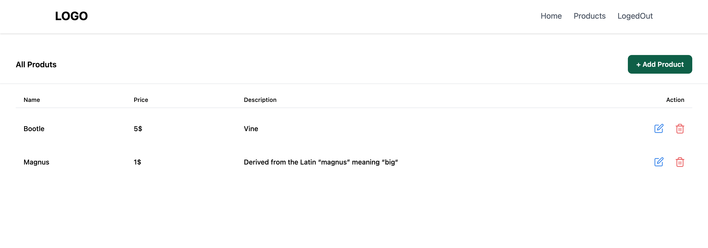

# ITHIRE

> Social network for developers

# Quick Start 🚀

### Add a default.json file in config folder with the following

```json
{
  "mongoURI": "<your_mongoDB_Atlas_uri_with_credentials>",
  "jwtSecret": "secret",
  "githubToken": "<yoursecrectaccesstoken>"
}
```

### Add a FireBaseImageUploader.js file on client/src/component/service

Add config of Firebase to upload the images 

### Install server dependencies

```bash
npm install
```

### Install client dependencies

```bash
cd client
npm install
```

### Run both Express & React from root

```bash
npm run dev
```

### Build for production

```bash
cd client
npm run build
```

## App Info

### Author
Usman Ahmad Awan

### Version

2.0.0

### License

This project is licensed under the MIT License




